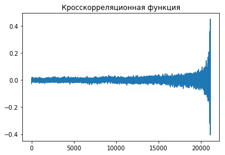
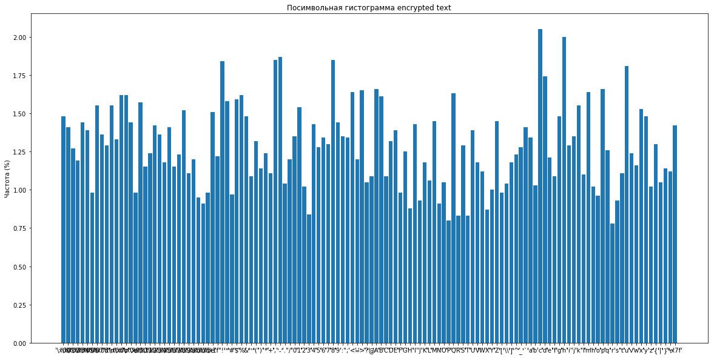
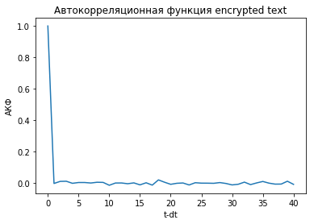
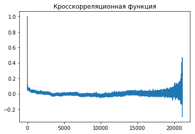

# Лабораторная работа №2

*Водяный Михаил, РИ-440005*

## Задание
Реализовать симметричный криптоалгоритм на основе простого гаммирования. Гаммирование осуществлять на основе алгоритма Макларена-Марсальи на основе двух конгруентных датчиков. Конгруэнтные ДСЧ создать на основе рекомендаций в книге Дональда Кнута и встроенного ГСЧ. Предоставить возможность сохранения гаммы в отдельный файл. Провести экспресс-анализ.

## 1. Определение функций

### 1.1. Кросскорреляционная функция


```python
import matplotlib.pyplot as plt
from statsmodels.tsa.stattools import ccf
from numpy import asarray

def ccf_analyse(data1, data2):
    code_chars_1 = asarray(list(map(ord, data1)))
    code_chars_2 = asarray(list(map(ord, data2)))
    plt.title('Кросскорреляционная функция')
    plt.plot(ccf(code_chars_1, code_chars_2))
    plt.show()
```

    C:\Users\Vodyanyy\AppData\Local\Continuum\anaconda3\lib\site-packages\statsmodels\compat\pandas.py:56: FutureWarning: The pandas.core.datetools module is deprecated and will be removed in a future version. Please use the pandas.tseries module instead.
      from pandas.core import datetools
    

### 1.2. Функции экспресс анализа


```python
def express_analyse(text, name):
    char_freq(text, name)
    acf_func(text, name)
```


```python
def char_freq(text, name):
    freq = symbol_count_dict(text)
    title = 'Посимвольная гистограмма ' + name
    make_plot(dictionary=freq, size=(20,10), title=title, ylabel='Частота (%)')
```


```python
from statsmodels.tsa.stattools import acf

def acf_func(text, name):
    charCodeList = list(map(ord, text))
    title = 'Автокорреляционная функция ' + name
    make_plot(data=acf(charCodeList), title=title, ylabel='АКФ', xlabel='t-dt')
```


```python
from collections import Counter, OrderedDict

def symbol_count_dict(text):
    symbolCounter = Counter(text).items()
    return OrderedDict(sorted(symbolCounter))
```


```python
import matplotlib.pyplot as plt

def make_plot(data=None, dictionary=None, xlabel=None, ylabel=None, size=None, title=None):
    
    if dictionary is not None:
        x_xticks = [repr(x) for x in dictionary.keys()]
        x = range(len(x_xticks))
        y = [round(dictionary[x]/len(dictionary), 2) for x in dictionary]
        plt.xticks(x, x_xticks)
        plt.bar(x, y, align='center')  
    elif data is not None:
        plt.plot(data)
    else:
        print('Set data or dictionary')
        return None
        
    if xlabel is not None:
        plt.xlabel(xlabel)
        
    if ylabel is not None:
        plt.ylabel(ylabel)
    
    if size is not None:
        plt.gcf().set_size_inches(size)
        
    if title is not None:
        plt.title(title)
        
    plt.show()
```

## 2. Реализация алгоритма


```python
from random import randint

CONST_A = 16807
CONST_M = 2147483647

def maclaren_marsaglia(length, k = 128): 
    x = 1
    lgc = list()
    for i in range(length):     
        x = (CONST_A * x) % CONST_M      
        lgc.append(x)
        
    gamma = list()
    for i in range(length):
        r = randint(0, k-1)
        gamma.append(lgc[r])

    return gamma
```


```python
def code_list(txt, gamma):
    code = list()
    for (c, g) in zip(txt, gamma):
        code.append(chr(ord(c) ^ g%128))
    return code
```


```python
def encrypt(text=None, filename=None, save_gamma=False, gamma_filename=None):
    
    if text is None:
        if filename is not None:
            with open(filename, 'r') as file:
                text = file.read()
        else:
            print('Set text or filename')
            return None
               
    gamma = maclaren_marsaglia(len(text))
    
    if save_gamma == True:
        with open(gamma_filename, 'w') as file:
            file.write(str(gamma))
    
    code = code_list(text, gamma)
        
    return ''.join(code)
```


```python
from ast import literal_eval

def decrypt(text=None, filename=None, gamma=None, gamma_file=None):
    
    if gamma is None:
        if gamma_file is None:
            print('Set gamma or gamma_file')
            return None
        else:
            with open(gamma_file, 'r') as file:
                gamma = file.read()
               
    gamma = literal_eval(gamma)
    
    if text is None:
        if filename is None:
            print('Set text or filename')
            return None
        else:
            with open(filename, 'r') as file:
                text = file.read()
        
    code = code_list(text, gamma)
        
    return ''.join(code)
```

## 3. Тестирование


```python
filename = 'Data//a06.txt'

with open(filename, 'r') as file:
    text = file.read()
    
textEnc = encrypt(text=text, save_gamma=True, gamma_filename='gamma_a06.txt')
```


```python
ccf_analyse(text, textEnc)
```





Между исходными и зашифрованными данными нет зависимости.


```python
express_analyse(textEnc, 'encrypted text')
```








Протестируем дешифровку текста.


```python
ccf_analyse(text, decrypt(textEnc, gamma_file='gamma_a06.txt'))
```





С задержкой 0 коэффициент корреляции 1, значит алгоритм дешифровки работает правильно.
